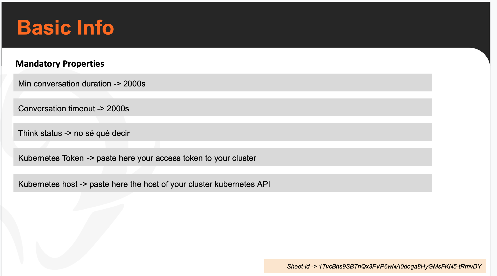
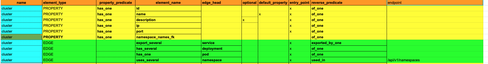
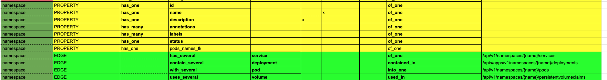
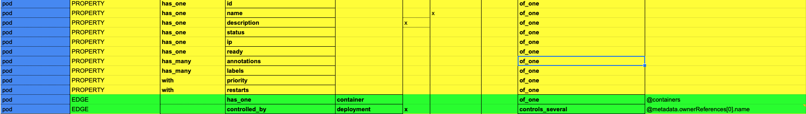
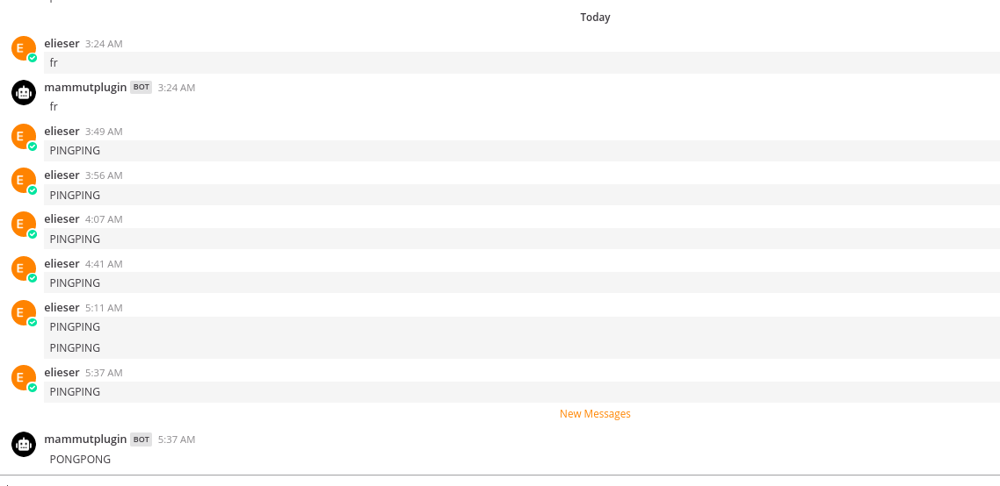

# Mattermost Mammut bot integration

Mammut is a project with the aim of chatbots with real conversational capabilities. Is an ongoing project and is not fully public yet.

This mattermost plugin allows you to integrate a Mattermost bot from your Mattermost deployment with Mammut platform for Kubernetes ChatOps operability from your Mattermost deployment.

These are the instructions for succesfully integrate the mattermost plugin with mammut public API.


# Simulated Kubernetes cluster vs Real connection cluster

Currently we support only a simulation of Kubernetes ChatOps. This means that the training package used for training the bot is hand written, and the bot will handle that static information in its knowledge base.

In the next weeks we'll fully support automatic data pulling from the Kubernetes cluster being associated.

## Simulated Kubernetes
For a simulation of your Kubernetes Cluster you need to write a Mammut Package. [Here is a tutorial on the topic](https://doc.mammut.io/basic-tutorial/). 

For that, you will create a Kubernetes Ontology a will fill the Knowledge by hand with your cluster information. With this, you can train your bot and he will handle sceneries using your hand written knowledge base based on your cluster.

You can create your package by cloning this templates for a Kubernetes mammut bot: [Copia de bKubernetes Package].

## Real connection cluster

We aim to support full automatic knowledge population of your mattermost mammut bot by obtaining it directly from your Kubernetes API cluster.

For prepare your package to use your Kubernetes API from your cluster you need to follow this steps:

1. Add an access token that has authorization in your cluster in your package. Add it to your presentation package



2. Specify the `path` to your resources for the kubernetes API in the `endpoint` column of your vertex ontology







# Integration steps

## Installing the plugin

[Elieser instructions here]
* Install the plugin in the mattermost deployment
* Create a new bot from within the plugin.
* Getting the Mammut Bot ID from this step. 

## Training the bot.

### Retrieve the ID of Alex Mammut
Mammut API Endpoint: `https://api.mammut.io/app:mammut-1/fixed-vertex?type-name=user&config-id=mammut&depth=1`
HTTP GET
Expected Response: 
```javascript
    {
        "count":1,
        "data": { 
            "user":[
                {
                    ...
                    "user-type":"machine",
                    "name":"Alex",
                    "id":8288,
                    "main-email":"alex@mammut.io",
                    ...
                }
            ]
        },
        "status":"Success"
    }
```

Keep that `id` field:
Alex mammut id: `8288`

### Create a new 'normal' user in Mammut: 
Mammut API Endpoint: `https://api.mammut.io/app:mammut-1/graph/user`
HTTP POST
Content-type application/json
```javascript
   {
       "user-type": "normal",
       "main-email": "testingemail@mammut.io"
   } 
```
Example response status code: `200 OK`
```javascript
{
    "status": "Success",
    "taskResult": [
        {
            "affectedElementId": 4136,
            "affectedElementName": "user",
            "affectedElementType": "Vertex",
            "taskIdList": [
                "Trigger: user-chat-in-room-created - Vertex: user(4136)"
            ]
        },
        {
            "affectedElementId": 4272,
            "affectedElementName": "room",
            "affectedElementType": "Vertex"
        },
        {
            "affectedElementId": 3077,
            "affectedElementName": "chat-in",
            "affectedElementType": "Edge"
        },
        {
            "affectedElementId": 2565,
            "affectedElementName": "create",
            "affectedElementType": "Edge"
        },
        {
            "affectedElementId": 8288,
            "affectedElementName": "user",
            "affectedElementType": "Vertex",
            "taskIdList": []
        },
        {
            "affectedElementId": 40960521,
            "affectedElementName": "chat-in",
            "affectedElementType": "Edge"
        }
    ]
}
```
Keep the first two objects `affectedElementId` fields. 

Id of your normal user: `4136` 
Id of your room with Mammut Alex: `4272`  

### Start a compilation training of your package

Need to have your presentation ID: `1fe9aNv4EAS7QIUY0zqZtEv6la91_V_D1IMQSFhP-Q1g`

Start a compilation training by making the request. 
Mammut API Endpoint: `https://98a75328.ngrok.io/app:mammut-1/actions/compile`
HTTP POST
Content-Type application/json

```javascript
    {
        "packageId": "1fe9aNv4EAS7QIUY0zqZtEv6la91_V_D1IMQSFhP-Q1g", //Your presentation Id
        "executeSamplingCorpus": true,
        "corpusIds": [1],
        "slideMetadataTokenSeparator": "->",
        "mammutId": 1234, //The Mammut id of your mattermost bot created using the plugin
        "userId": 4136, // The user id previously created.
        "roomId": 4272, // The room id previously created.
        "regionalSettings": "en",
        "mammutLoggerId": 8288 // Alex mammut Id
}
```
Example response status code: `200 OK`

### Wait for your compilation to succeed

Keep yourself making request to your compilation room until you can see there was a `succesfull compilation` message.
Mammut API Endpoint: `https://api.mammut.io/app:mammut-1/graph:1/room:4272/with::thought?creation-date.last(20)`
HTTP POST
Content-Type application/json

```javascript
    {
    "count": 1,
    "data": {
        "thought": [
            ...
            {
                "text": "...",
                "id": 4152,
                "creation-date": "2019-12-07T22:02:42+00:00",
            },
            {
                "text": "...",
                "id": 8272,
                "creation-date": "2019-12-07T22:02:42+00:00",
            {
                "text": "Compilation completed successfully. Extra information: Finished compilation for Compilation Task: 4176 - Compilation Summary:Mammut: 4176: Total of Variables: 15 - Total of Synthetic Dictionary Entries: 23 - Total of Tuples: 16",
                "id": 12352,
                "creation-date": "2019-12-07T22:03:12+00:00",
            }
            ...
        ]
    },
    "status": "Success"
}
```

### Test your bot using Mattermost!

