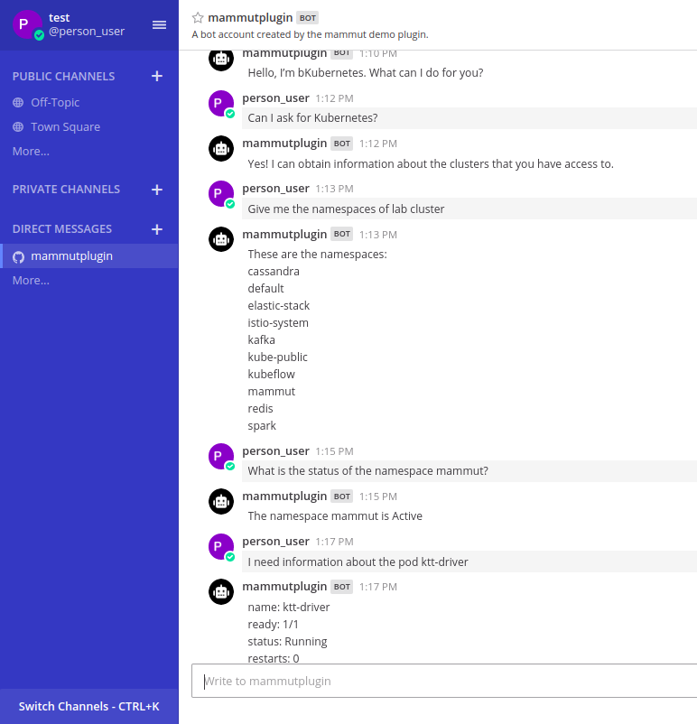

# Mattermost Mammut bot integration

Mammut is a project with the aim of provide chatbots with real conversational capabilities. Is an ongoing project and is not fully public yet.

We're developing a documentation site including a wide range of content: key concepts within Mammut platform, tutorials, integrations with different platforms and tools. [Our site](https://mammut.io/) will contain the news when the official documentation goes out!.

This mattermost plugin allows you to integrate a Mattermost bot from your Mattermost deployment with Mammut platform for Kubernetes ChatOps operability from your Mattermost deployment.

These are the instructions for succesfully integrate the mattermost plugin with mammut public API .

# Simulated Kubernetes cluster 

Currently we support only a simulation of Kubernetes ChatOps. This means that the training package used for training the bot is hand written, and the bot will handle that static information in its knowledge base.

The next steps in this section will walk throught the successfull training and the simulation of sceneries found in the training package.

## Preparing your package

1. Make a copy of our Kubernetes [package spreadsheet](https://docs.google.com/spreadsheets/d/1TvcBhs9SBTnQx3FVP6wNA0doga8HyGMsFKN5-tRmvDY)


2. Make a copy of our Kubernetes [package presentation](https://docs.google.com/presentation/d/1fe9aNv4EAS7QIUY0zqZtEv6la91_V_D1IMQSFhP-Q1g)


3. Edit the *Sheet-Id* on the presentation with the `ID` of your spreadsheet copy.


4. Change the permissions to your spreadsheet and presentation documents to *anyone with the link can edit*:

 

## Installing the plugin

[Elieser instructions here]
* Install the plugin in the mattermost deployment
* Create a new bot from within the plugin.
* Getting the Mammut Bot ID from this step. 

## Training the bot.

### Retrieve the ID of Alex Mammut
Mammut API Endpoint: `https://api.mammut.io/app:mammut-1/fixed-vertex?type-name=user&config-id=mammut&depth=1`
HTTP GET
Expected Response: 
```javascript
    {
        "count":1,
        "data": { 
            "user":[
                {
                    ...
                    "user-type":"machine",
                    "name":"Alex",
                    "id":8288,
                    "main-email":"alex@mammut.io",
                    ...
                }
            ]
        },
        "status":"Success"
    }
```

Keep that `id` field:
Alex mammut id: `8288`

### Create a new 'normal' user in Mammut: 
Mammut API Endpoint: `https://api.mammut.io/app:mammut-1/graph/user`
HTTP POST
Content-type application/json
```javascript
   {
       "user-type": "normal",
       "main-email": "testingemail@mammut.io"
   } 
```
Example response status code: `200 OK`
```javascript
{
    "status": "Success",
    "taskResult": [
        {
            "affectedElementId": 4136,
            "affectedElementName": "user",
            "affectedElementType": "Vertex",
            "taskIdList": [
                "Trigger: user-chat-in-room-created - Vertex: user(4136)"
            ]
        },
        {
            "affectedElementId": 4272,
            "affectedElementName": "room",
            "affectedElementType": "Vertex"
        },
        {
            "affectedElementId": 3077,
            "affectedElementName": "chat-in",
            "affectedElementType": "Edge"
        },
        {
            "affectedElementId": 2565,
            "affectedElementName": "create",
            "affectedElementType": "Edge"
        },
        {
            "affectedElementId": 8288,
            "affectedElementName": "user",
            "affectedElementType": "Vertex",
            "taskIdList": []
        },
        {
            "affectedElementId": 40960521,
            "affectedElementName": "chat-in",
            "affectedElementType": "Edge"
        }
    ]
}
```
Keep the first two objects `affectedElementId` fields. 

Id of your normal user: `4136` 
Id of your room with Mammut Alex: `4272`  

### Start a compilation training of your package

Need to have the presentation ID of your presentation copy made in the section [Preparing your package](##preparing-your-package)

Start a compilation training by making the request. 
Mammut API Endpoint: `https://98a75328.ngrok.io/app:mammut-1/actions/compile`
HTTP POST
Content-Type application/json

```javascript
    {
        "packageId": "presentation-id", //Your presentation Id
        "executeSamplingCorpus": true,
        "corpusIds": [1],
        "slideMetadataTokenSeparator": "->",
        "mammutId": 1234, //The Mammut id of your mattermost bot created using the plugin
        "userId": 4136, // The user id previously created.
        "roomId": 4272, // The room id previously created.
        "regionalSettings": "en",
        "mammutLoggerId": 8288 // Alex mammut Id
}
```
Example response status code: `200 OK`

### Wait for your compilation to succeed

Keep yourself making request to your compilation room until you can see there was a `succesfull compilation` message.
Mammut API Endpoint: `https://api.mammut.io/app:mammut-1/graph:1/room:4272/with::thought?creation-date.last(20)`
HTTP GET
Content-Type application/json

```javascript
    {
    "count": 1,
    "data": {
        "thought": [
            ...
            {
                "text": "...",
                "id": 4152,
                "creation-date": "2019-12-07T22:02:42+00:00",
            },
            {
                "text": "...",
                "id": 8272,
                "creation-date": "2019-12-07T22:02:42+00:00",
            {
                "text": "Compilation completed successfully. Extra information: Finished compilation for Compilation Task: 4176 - Compilation Summary:Mammut: 4176: Total of Variables: 15 - Total of Synthetic Dictionary Entries: 23 - Total of Tuples: 16",
                "id": 12352,
                "creation-date": "2019-12-07T22:03:12+00:00",
            }
            ...
        ]
    },
    "status": "Success"
}
```

### Test your bot using Mattermost!


Now that the compilation completed successfully, We can talk with the bot using the sceneries from the `corpus` sheet in the spreadsheet.



We can use any of the scenery examples in the sheet. This bot doesn't have AI activated yet, so It can only handle conversations like the ones in the sheet.
We'll support AI for the NLP in the sooner future so the bots can handle any kind of conversation!.

# Upcoming: Real connection cluster

We aim to support full automatic knowledge population of your mattermost mammut bot by obtaining it directly from your Kubernetes API cluster.
In the next weeks we'll fully support automatic data pulling from the Kubernetes cluster being associated.

For prepare your package to use your Kubernetes API from your cluster you need to follow this steps:

1. Add an access token that has authorization in your cluster in your package. Add it to your presentation package


2. Specify the `path` to your resources for the kubernetes API in the `endpoint` column of your vertex ontology


